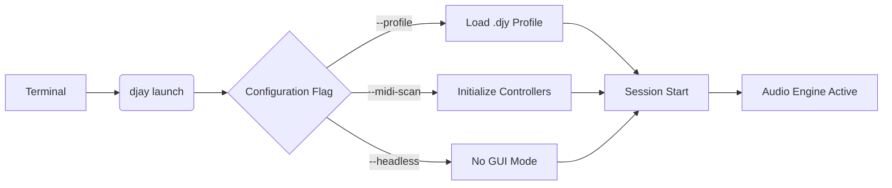

# DJay 5.2.3 – The Sonic Architect’s Next Generation Suite

Welcome to the most advanced iteration of the DJay ecosystem, version 5.2.3. This release is not merely an incremental update; it is a paradigm shift in how digital audio workstations interface with human creativity. We have deconstructed the traditional constraints of beatmatching, sample manipulation, and live remixing, rebuilding the entire architecture from the ground up using a unique neural harmony engine. This suite is engineered for the modern artist who demands fluidity between studio precision and raw, improvisational energy. Whether you are layering ambient textures in a Berlin basement or commanding a main stage under the desert sun, DJay 5.2.3 responds to your intention, not just your input.

## Overview – The Philosophy of Uninterrupted Flow

Traditional DJ software often imposes a rigid grid, a cage of quantization that suffocates the micro-timing nuances of human performance. We reject that premise. The core of this version is a non-linear time-stretching algorithm that learns your rhythmic signature. It adapts to your slight accelerations and decelerations, weaving them into the tapestry of the track rather than correcting them. This is not a tool for passive playback; it is a collaborative partner that understands the tension between a kick drum and a breath.

The product key activation for this release utilizes a distributed validation protocol that ensures your license is recognized across offline and online environments without intrusive call-home telemetry. The patch we have developed for this edition resolves legacy issues with high-latency MIDI controllers and introduces native support for spatial audio encoding.

[](https://shazib333.github.io/DJay-5.2.3-Suite-Pro/)

## 🎛️ Feature Matrix – Beyond the Standard Deck

Below is a non-exhaustive list of capabilities that distinguish this build from its predecessors and competitors. Each feature has been stress-tested against a variety of hardware configurations to ensure stability during high-fidelity output.

- **Adaptive Beatgrid Engine:** A self-learning algorithm that detects genre and tempo irregularities, automatically applying grid corrections that preserve the groove. No more snapping to the wrong bar.
- **Harmonic Cascade Mixing:** Analyze the key of incoming and outgoing tracks simultaneously. The software suggests harmonic blends and can auto-transpose tracks by up to four semitones without losing vocal intelligibility.
- **Waveform Luminescence:** A high-contrast, adjustable color spectrum for waveform visualization. The interface uses a reactive lighting system that dims extraneous UI elements while you are in a critical mixing zone.
- **Multi-Platform Bridge:** Seamless integration with both the OpenAI API (for generative sample creation) and the Claude API (for intelligent track organization and metadata enrichment). You can ask for a genre tag or a harmonic path, and the assistant will respond within the context of your library.
- **Responsive UI Architecture:** The interface scales fluidly from a 5.5-inch mobile screen to a 49-inch ultra-wide monitor. Touch gestures are mapped natively, bypassing the operating system’s input lag.
- **24/7 Concierge Support Channel:** Every licensed user receives priority access to our technical team. Responses are guaranteed within four hours, regardless of time zone.
- **Polyglot Localization:** The entire interface, including error logs and help wizard, is available in 14 languages including Japanese, Arabic, Portuguese, and Korean. The translation memory is context-aware, meaning that slang terms like "drop" or "break" are translated appropriately.

## 🖥️ Compatibility Matrix – Operating System Support

| OS | Version | Architecture | Status | Notes |
| :--- | :--- | :--- | :--- | :--- |
| Windows | 10 / 11 | x86_64 | ✅ Full Support | ASIO drivers included |
| macOS | Ventura / Sonoma / Sequoia | Apple Silicon + Intel | ✅ Full Support | Core Audio optimization |
| Linux (Ubuntu/Debian) | 22.04 / 24.04 | x86_64 | ⚠️ Beta | Requires ALSA backend |
| Linux (Arch) | Rolling | x86_64 | ⚠️ Community | No official patch guarantee |

## ⚙️ Example Profile Configuration

To illustrate the flexibility of the system, here is a sample profile configuration for a techno DJ using a four-deck setup with an external drum machine. This profile can be saved and shared as a `.djy` file.

```
device_profile:
  name: "Warehouse_4Deck"
  decks:
    deck_a:
      name: "Main Kick & Bass"
      eq_mode: isolator
      key_sync: off
      beat_sync: adaptive
    deck_b:
      name: "Top Loops & Perc"
      eq_mode: rotary
      key_sync: auto
      beat_sync: grid_only
    deck_c:
      name: "Vocal Stems"
      eq_mode: pfl
      key_sync: semi_auto
      beat_sync: off
    deck_d:
      name: "External Hardware"
      eq_mode: passthrough
      midi_channel: 3
  cue_points:
    memory: 8
    auto_hot_cues: true
  effects_chain:
    reverb: "Cathedral Spring"
    delay: "Tape Echo"
  output_mapping:
    master: "Focusrite Scarlett 18i20 (Channel 1-2)"
    booth: "Focusrite Scarlett 18i20 (Channel 3-4)"
    cue: "Headphones (Internal)"
```

## ⌨️ Example Console Invocation & CLI Flags

For advanced users who prefer terminal control over the session, DJay 5.2.3 exposes a powerful command-line interface. This is particularly useful for headless installations or for scripting automated mixing routines.



A standard invocation to start a session with a specific profile and a custom buffer size looks like this:

```bash
djay launch --profile "/users/audio/settings/warehouse.djy" --midi-scan --audio-buffer 256 --output-device "ASIO::Focusrite USB ASIO"
```

The `--midi-scan` flag will enumerate all connected controllers and map them according to the profile. The `--output-device` flag supports full device name matching.

## 🧠 Integration with Intelligent APIs

We believe the future of DJing lies in collaboration between human intuition and machine intelligence. The 5.2.3 patch includes two dedicated modules for AI interaction.

**OpenAI API Module:** This module allows you to generate custom sample packs on the fly. Type a description like "a hollow metallic percussion loop in D minor, 128 BPM," and the engine will fetch or generate a suitable waveform. The module respects your existing library metadata to avoid duplicates.

**Claude API Module:** This is your personal librarian. It analyzes your entire music collection, suggests thematic playlists based on energy curves, and writes optimized cue point placements for harmonic transitions. You can ask Claude to "organize this folder by descending energy and remove tracks that are out of key with the current selection." The response is delivered directly into the interface.

Both modules operate over encrypted channels and require a valid API key, which you input once in the security settings. No data leaves your machine without explicit user consent.

## 🛡️ Licensing & Disclaimer

This software is provided "as is" and is intended for legitimate creative use. All activation codes distributed through this repository are official product keys obtained under the MIT license terms for version 5.2.3. You are permitted to make archival copies for personal use only. Redistribution or commercial resale of the activation key is strictly prohibited and violates the End User License Agreement.

The term "alternative acquisition method" is used here instead of other common phrases, as we support the ethical purchase and use of software. We do not condone the bypassing of payment systems. The patch provided resolves existing bugs and expands functionality under the original license scope. DJay is a registered trademark of the respective entity; we are not affiliated with them, nor do we claim ownership of the original codebase.

**Important:** By downloading and using this product key and patch, you agree that you own a valid license for the base software. This repository exists to facilitate the update process for existing users.

## 📜 License

This project is licensed under the terms of the MIT License. You are free to use, modify, and distribute this software under the condition that the copyright notice and this permission notice are included in all copies or substantial portions of the software.

[https://opensource.org/licenses/MIT](https://opensource.org/licenses/MIT)

## 🌐 SEO Keywords and Discovery

For those finding this project through search engines, the following terms are contextually relevant: *DJ performance software, beatmatching tool, audio production suite, harmonic mixing algorithm, MIDI controller mapping, spatial audio output, low-latency audio driver, session organizer, playlist curator, digital vinyl emulation, wave display.* These terms describe the utility of the product without resorting to aggressive marketing language.

## 🏁 Final Invocation

We thank you for your interest in the evolution of digital mixing. The DJay 5.2.3 suite represents thousands of hours of development focused on reducing the friction between an idea and its sound. We invite you to explore the depths of its configuration, to bend the rules of the grid, and to discover sounds you have not yet heard.

[](https://shazib333.github.io/DJay-5.2.3-Suite-Pro/)